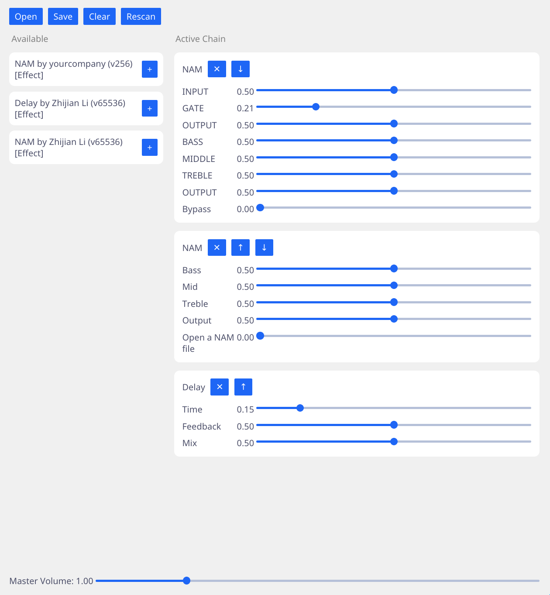

# Rake
A simple VST3 audio plugin host built with Rust. It uses [rack](https://github.com/sinkingsugar/rack) for plugin hosting, [Iced](https://iced.rs/) for GUI and [JACK](https://github.com/RustAudio/rust-jack) for audio I/O.



## Features
* Load and delete plugins
* Reorder plugin chain (Move plugin Up/Down)
* Save and restore entire plugin chain
* GUI sliders for plugin parameters

## Build
```bash
git clone https://codeberg.org/lzj15/rake.git
cd rake
cargo run --release

# Buffer size can be controlled using PIPEWIRE_LATENCY
PIPEWIRE_LATENCY=128/48000 cargo run --release
```

Use a PipeWire patchbay such as Helvum to change audio port connections.

A xdg-desktop-portal with file chooser implemented need to be installed for the file chooser to show on Linux.

## Current Issues
* Opening a plugin's custom GUI is not supported.
* Plugin's parameters can't be denormalized since min & max values always gives 0.0 and 1.0.
* Plugin's state other than the parameters can't be saved & restored.
